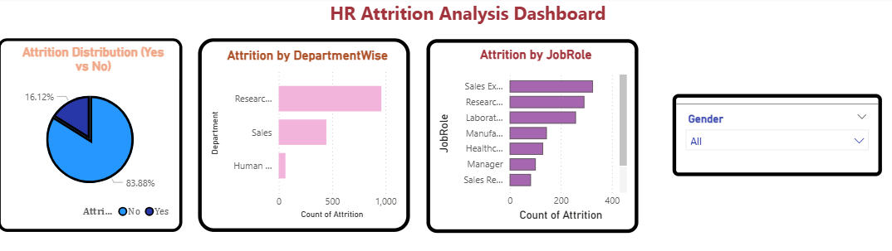

# HR Attrition Analysis Dashboard

## 📊 Project Overview
This project focuses on analyzing employee attrition using SQL and Power BI.  
The goal is to identify key factors that lead to employee turnover.

---

## 🧹 Data Cleaning (SQL)
- Checked for null values
- Removed duplicate records
- Standardized Attrition column (Yes/No)
- Dropped unnecessary columns (Over18, EmployeeCount, StandardHours)

---

## 📈 Key Analysis
- Overall Attrition Rate
- Department-wise Attrition
- Job Role-wise Attrition
- Overtime Impact on Attrition
- Salary vs Attrition
- Performance vs Attrition

---

## 📊 Power BI Dashboard
Created an interactive dashboard with:
- Attrition distribution (Pie Chart)
- Department-wise analysis (Bar Chart)
- Job Role risk analysis
- Overtime impact visualization
- Gender filter (Slicer)

---

## 🛠 Tools Used
- SQL (MySQL)
- Power BI
- Excel / CSV

---

## 💡 Key Insights
- Higher attrition observed in certain job roles
- Employees working overtime tend to leave more
- Salary plays an important role in employee retention
- Performance and experience influence attrition

---

## 🚀 Conclusion
This project helps in understanding employee behavior and can assist HR teams in improving retention strategies.

## 📷 Dashboard Preview

